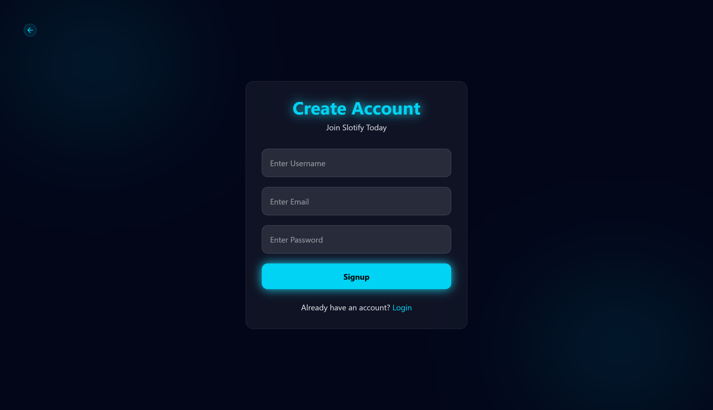
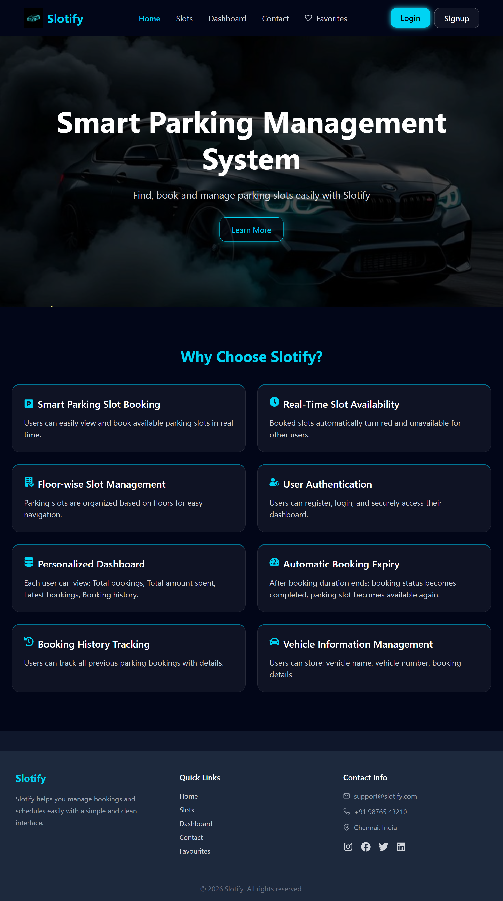
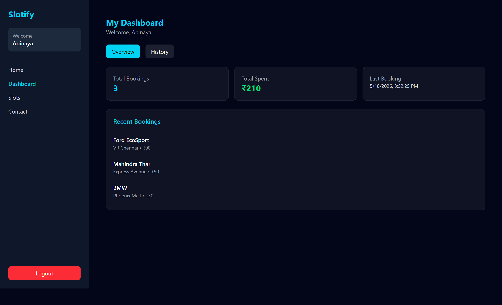
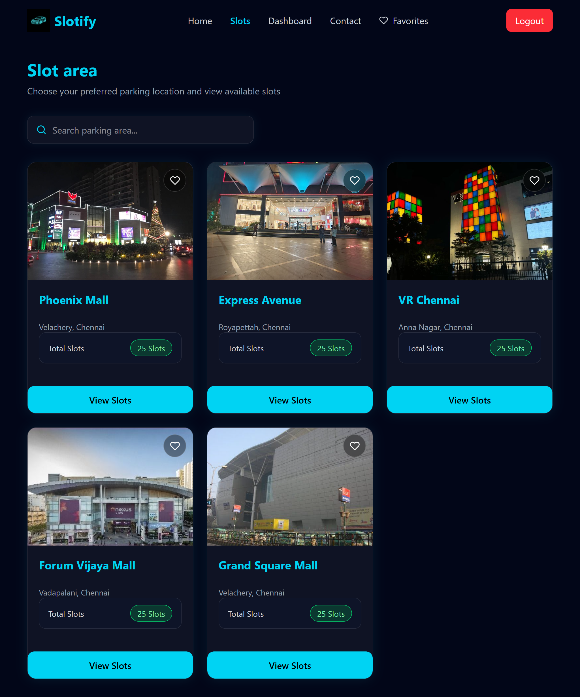
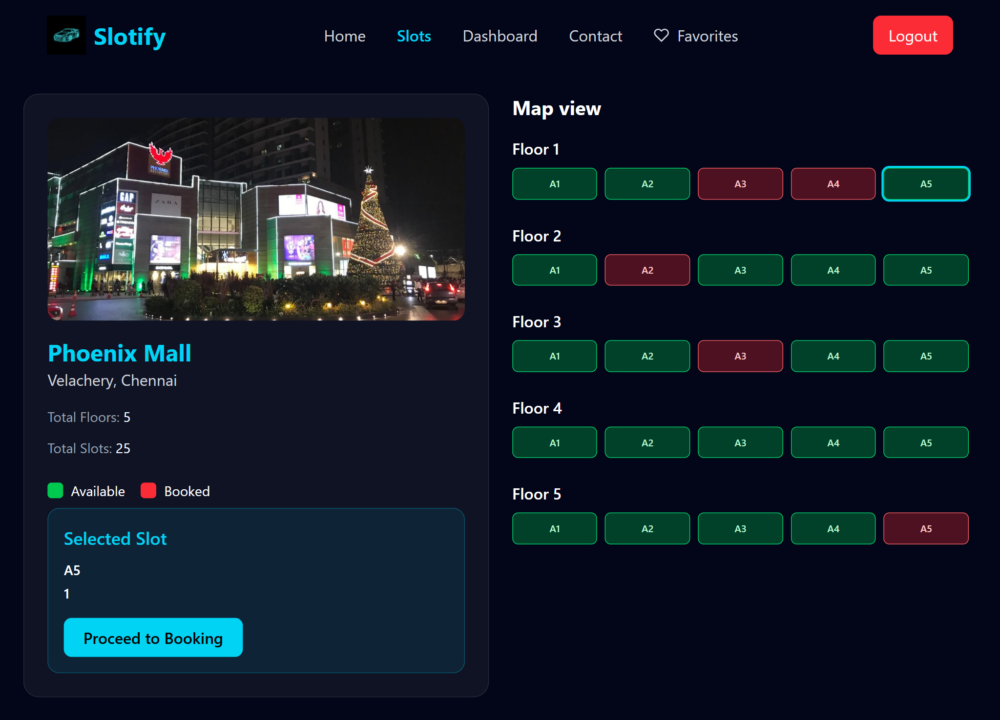

# Smart Parking Slot Booking System

A modern React-based parking slot booking application that allows users to browse parking areas, view slot details, add favourites, and manage bookings with a clean and responsive UI.

---
## Screenshots### Landing

### Signup

### Landing

### Dashboard

### Slot Area

### Details

## Features

- User Authentication
- Browse Parking Areas
- Search Parking Locations
- View Parking Slot Details
- Add / Remove Favourites
- Protected Routes
- Responsive Design
- JSON Server API Integration
- Dynamic Routing using React Router
- Persistent Favourite System

---

## Tech Stack

### Frontend
- React.js
- React Router DOM
- Tailwind CSS
- React Icons

### Backend / Mock API
- JSON Server

### Authentication
- Local Storage Based Authentication

---
### Key Functionalities
- Favourite System:
- Add parking areas to favourites
- Remove favourites instantly
- Persist favourites after refresh

- Search Functionality:
- Parking Name
- Location

- Protected Routes:
- Unauthenticated users cannot access protected pages.

### Author
- Abinaya Thirumaran

### License
- This project is created for learning and educational purposes.

